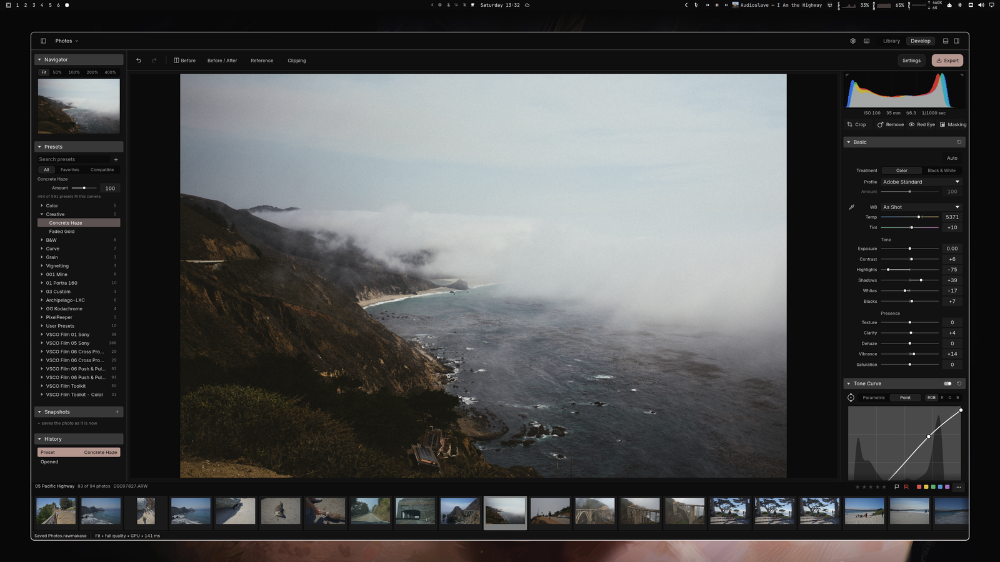

<h1> RAWmakase</h1>

*/raw·muh·KAH·say/, RAW + omakase*

RAWmakase is a fast, non-destructive RAW photo developer for Linux, macOS and Windows, written in Rust. It opens RAW files from the cameras LibRaw supports, develops them with a Lightroom-style set of controls, and exports JPEG or 16-bit TIFF. It can also import a Lightroom Classic catalog with its ratings, flags, labels, keywords and compatible develop settings, without ever writing to the original catalog or your photos.



<p align="center">
  <a href="https://github.com/pch/rawmakase/releases/latest"><strong>⬇ Download the latest version</strong></a><br>
  <sub>macOS (Apple Silicon, Intel) · Linux (.deb, .rpm, Arch) · Windows (x86_64, ARM64) · <a href="#install">install notes</a></sub>
</p>

It is a personal project in active development. It develops photos from almost every current camera; the exceptions are Sigma's Foveon cameras, monochrome cameras such as the Leica Monochrom, and DNGs that are already demosaiced ("linear" DNGs, such as merged HDR or panorama files). Rendering aims for close, not exact, Lightroom parity; see [parity gaps](docs/parity-gaps.md).

## Features

- **Develop**: white balance and picker, one-click Auto tone and Auto white balance, exposure and tone, Shadows/Highlights, Clarity, Dehaze, point curves and levels, HSL color mixer, three-way color grading, detail (denoise and sharpening), crop, straighten and Transform, lens corrections, effects and calibration.
- **Spot removal and masks (experimental, early)**: Heal and Clone spots and brushed areas with automatic sources, and brush, gradient and range masks with local adjustments, also imported from Lightroom. Not yet measured against Lightroom.
- **Library**: SQLite catalogs, folders, ratings, flags, color labels, filtering, and non-destructive Lightroom `.lrcat` import with folder relinking.
- **Presets and profiles**: 26 built-in presets and your Lightroom XMP presets; RAWmakase's own Standard and Color profiles for every camera with a usable color matrix, plus DCP and XMP camera profiles you import yourself.
- **Non-destructive**: originals are never modified. Edits live in the catalog, and all writes are atomic.
- **Fast previews**: every change renders at viewport size, with the color and tone stage on the GPU (Metal on macOS, Vulkan on Linux, DirectX 12 or Vulkan on Windows) and a CPU fallback.
- **Command line**: inspect, render, export thumbnails, import catalogs and profiles, and benchmark without the GUI.
- **External control**: [MIDI controllers](docs/midi.md), [scripts](docs/automation.md), and a built-in [MCP server](docs/mcp.md) for agents to adjust the running editor, inspect previews, save and export.
- **Updates**: the app checks GitHub for new releases; the Apple Silicon and Windows installer builds update themselves, other installs are pointed at the release page.

## Coming soon

- LUT support
- AI-powered masks and object removal
- Agentic features: e.g. culling assistance

## Install

Download the package for your system from [GitHub Releases](https://github.com/pch/rawmakase/releases). Older releases may have only the original Arch-built Linux archive; use the requirements in that release's notes.

### Let your agent install it

Point your coding agent to [GitHub Releases](https://github.com/pch/rawmakase/releases) and tell it to install the latest version for your operating system, or give it this prompt:

```text
Install the latest release of RAWmakase for my operating system from https://github.com/pch/rawmakase/releases. Pick the right package for my OS and CPU architecture, verify it against the release's checksums, install it, and tell me how to launch it.
```

### Omarchy

Install `rawmakase-bin` from **Omarchy menu → Install → Package**, or from a terminal:

```sh
omarchy pkg add rawmakase-bin
```

It updates with the rest of the system.

### macOS (15 or newer)

Install with Homebrew:

```sh
brew install --cask pch/tap/rawmakase
```

Update with `brew upgrade --cask rawmakase`.

Or install the DMG directly:

Choose `rawmakase-v<version>-macos-arm64.dmg` for Apple Silicon or `rawmakase-v<version>-macos-x86_64.dmg` for Intel. Open the DMG, drag **RAWmakase** into **Applications**, and launch it there. Release DMGs are signed and notarized, and include their imaging libraries; Homebrew is not required.

### Linux (x86_64 and aarch64)

Download the package for your architecture (`amd64`/`x86_64` or `arm64`/`aarch64`), then run the matching command from its folder, replacing the filename with the one you downloaded:

| System | Package | Install |
| --- | --- | --- |
| Ubuntu 24.04+ / Debian 13+ | `.deb` | `sudo apt install ./rawmakase_<version>_amd64.deb` |
| Fedora 43+ | `.rpm` | `sudo dnf install ./rawmakase-<version>-1.x86_64.rpm` |
| Arch Linux (x86_64) | `.pkg.tar.zst` | `sudo pacman -U ./rawmakase-<version>-1-x86_64.pkg.tar.zst` |

DEB/RPM packages include LibRaw and Little CMS. Arch packages use system dependencies. A working graphics driver is required; install your desktop's `xdg-desktop-portal` backend for native file dialogs.

**AUR publication is paused.** Install the Arch package directly, or (on Arch Linux ARM too) download and extract `rawmakase-<version>-arch-recipe.tar.gz` into an empty folder and build as a normal user:

```sh
makepkg -si
```

The development recipe is in [packaging/arch/rawmakase-git](packaging/arch/rawmakase-git/PKGBUILD).

The `rawmakase-<version>-<arch>-linux.tar.gz` download contains the same bundled imaging libraries as the DEB/RPM packages. Extract it and run `./usr/bin/rawmakase` from the extracted folder. Keep the whole directory together. It requires the same OS/runtime baseline as the packages above; it is not a fully static build.

### Windows (10 or newer on x86_64, 11 on ARM64)

Run `rawmakase-v<version>-x86_64-pc-windows-msvc-setup.exe`, or `rawmakase-v<version>-aarch64-pc-windows-msvc-setup.exe` on an ARM64 PC. It installs for your user account only, without administrator rights, and adds RAWmakase to the Start menu. The installer is not code-signed yet, so Microsoft Defender SmartScreen may warn about an unrecognized app: choose **More info → Run anyway**. For a copy without installing, extract `rawmakase-v<version>-<arch>-pc-windows-msvc.zip` and run `rawmakase.exe` from the extracted folder.

### Updates and verification

RAWmakase checks GitHub for a newer release after launch and once an hour, and shows a notice when one is out (turn the check off in Preferences). The Apple Silicon DMG and the Windows installer download and install the update themselves; Intel Macs, the Linux tarball, the Windows archive and package-managed installs (Homebrew, DEB, RPM, Arch) are pointed at the release page or their package manager. Settings and catalogs are kept separately from the installed application, so reinstalling over an old version loses nothing.

### Usage stats

After first-run setup, RAWmakase asks once whether to send an anonymous usage report once a week: the version, the system and how it was installed, with no identifier, files or photos. It is off until you agree, the question shows the exact report, and Preferences > General changes the answer. `DO_NOT_TRACK=1` turns it off. See [docs/usage-stats.md](docs/usage-stats.md) and the totals at [stats.rawmakase.com](https://stats.rawmakase.com).

Each new packaged release includes `SHA256SUMS`. After downloading it beside your package, verify downloaded files on Linux with `sha256sum --ignore-missing -c SHA256SUMS`. On macOS, use `shasum -a 256 <downloaded-file>` and compare the result with that file's entry in `SHA256SUMS`.

### From source (Linux and macOS)

You need Rust 1.98 or newer, a C++17 compiler with OpenMP, pkg-config, LibRaw 0.22 or newer, and Little CMS 2.

- Arch Linux: `sudo pacman -S rust base-devel pkgconf libraw lcms2`
- macOS: `brew install pkg-config libraw little-cms2 libomp`. Use a native rustup toolchain (`aarch64-apple-darwin` on Apple Silicon); `LIBOMP_PREFIX` points the build at a non-Homebrew OpenMP.

```sh
make                                  # cargo build --release --locked
make install PREFIX="$HOME/.local"    # binary, desktop entry, icon and licenses
```

`make install` never builds, so `make && sudo make install PREFIX=/usr` does not compile as root. `make uninstall` removes the installed files.

On macOS, `packaging/macos/app.sh` builds `target/release/RAWmakase.app`, which you can open from Finder. It uses the Homebrew libraries installed on your Mac and is not a signed, self-contained distribution.

## Usage

```sh
rawmakase                     # reopen the last catalog
rawmakase Photos.rawmakase    # open a catalog
rawmakase photo.dng           # add the photo's folder to the last catalog and edit it
```

Photos are edited through the Library. The first launch starts a catalog named Photos in RAWmakase's data folder and asks for a folder of photos; to keep your Lightroom Classic folders, ratings and edits, import its catalog instead. Both, and other catalogs, are available later from the **Catalog** menu. Folders dropped onto the window, one or several, are added to the open catalog; right-click a folder in the Library's Folders panel to remove it and its photos from the catalog (the files stay on disk). A photo dropped there or passed on the command line has its folder added, then opens in Develop; edits it got in earlier releases (its `photo.rawmakase.json`) come along. You can also drop a catalog onto the window. The camera's embedded JPEG shows immediately while the RAW develops.

Useful shortcuts:

| Key | Action |
| --- | --- |
| Left / Right | Previous / next photo |
| F / Z | Fit / toggle Fit and 100% |
| 0–5, 6–9 | Rating; red, yellow, green, blue label |
| P / X / U | Pick / reject / clear flag |
| Shift + rating, label or flag key | Apply and advance |
| R or C | Crop |
| J | Shadow and highlight clipping warnings (click a histogram triangle for one) |
| Backslash | Before alone |
| Y / Option+Y / Shift+Y | Before and after: left and right / top and bottom / split |
| I | Photo info over the photo: Info 1, Info 2, off |
| Shift+R | Reference View: another photo beside the one you edit (drag it from the filmstrip) |
| Tab / Shift+Tab | Hide or show the side panels / also the filmstrip and status bar |
| F7 / F8 / F6 | Hide or show the left panel / right panel / filmstrip |
| Cmd/Ctrl+Z, Cmd/Ctrl+Shift+Z | Undo / redo |
| Cmd/Ctrl+Shift+U | Auto tone |

Double-click a slider or a color grading wheel to reset it, type its value for precision, or hover a slider and press Up or Down (Shift for ten steps). On a grading wheel, Shift keeps a drag to hue or saturation and Cmd/Ctrl moves it finely. Drag sideways in the histogram to move Blacks, Shadows, Exposure, Highlights or Whites, whichever region you start in.

Tab hides the side panels to give the photo the window, and Shift+Tab the filmstrip too; pressed again, each brings back the panels it hid. The panel buttons at either end of the top bar hide or show the left panel, the right panel or the filmstrip alone.

The switch in a panel's header turns the panel off without losing its settings, as in Lightroom; right-click a header for Solo Mode, where opening one panel closes the others on that side.

### Camera profiles

Every camera with a usable color matrix gets two profiles of RAWmakase's own: **RAWmakase Standard** (the camera's color matrix with the DNG default tone curve) and **RAWmakase Color** (a mild look on top of it). A new photo uses a compatible imported Adobe Color, then Adobe Standard, then a DNG's own profile, and RAWmakase Color when it has none of those. No Adobe profiles are bundled. For Lightroom's color, import DCP and XMP profiles you are licensed to use (for example from your own Lightroom or Camera Raw installation, or published third-party DCPs such as RawTherapee's) from the **Profile** menu in Develop, from **Preferences**, or with `rawmakase import-profiles`. On a Mac or PC, the Profile menu also looks in Camera Raw's profile folder and, when it finds profiles filed under the camera's name, offers to import them in one click. Imported profiles are copied into RAWmakase's own data directory. See [Lightroom profiles](docs/lightroom-profiles.md).

### Command line

```sh
rawmakase inspect photo.dng
rawmakase thumbnail photo.dng embedded.jpg
rawmakase render photo.dng edited.jpg --exposure 0.7 --max-edge 2400
rawmakase render photo.dng edited.tiff --xmp preset.xmp
rawmakase render photo.dng edited.jpg --auto
rawmakase import-catalog Lightroom.lrcat Photos.rawmakase
rawmakase help
```

`render` starts from the photo's default look, or from an edit a release before 0.1.8 saved as a sidecar (`photo.dng.rawmakase.json` beside the photo, or in the data directory's `sidecars/` folder, whichever is newer). `--recipe` replaces that starting point with a saved RAWmakase preset; `--xmp` applies an XMP preset on top of it, so settings the XMP leaves out keep the starting point's values. For a render that depends on nothing saved, pass `--recipe`. It does not read edits from a catalog yet, so exporting Develop edits is done from the app. It needs `--overwrite` to replace an existing file.

### Where data lives

- Catalogs, with every edit: the `.rawmakase` file you choose.
- Edits saved beside photos by releases before 0.1.8 (`photo.dng.rawmakase.json`, with spots and masks in `photo.dng.rawmakase-local.json`, or in the data directory's `sidecars/` folder for read-only locations) are brought into the catalog when you add their folder, and left as they are.
- Profiles, presets, previews and session state: `~/Library/Application Support/RAWmakase` on macOS, `$XDG_DATA_HOME/rawmakase` (default `~/.local/share/rawmakase`) on Linux, `%APPDATA%\RAWmakase` on Windows. `RAWMAKASE_DATA_DIR` overrides it.

Exports are always sRGB. The display defaults to sRGB; pick a monitor ICC profile under **More** only if your compositor does not already manage color.

## Development

Start with the [code map](docs/code-map.md) and the [architecture guide](docs/architecture.md).
The [website source and deployment guide](website/README.md) live in `website/`.
The opt-in [usage stats service](stats/README.md) lives in `stats/`.

```sh
make check    # cargo fmt --check, clippy -D warnings, cargo test
```

The repository contains no RAW photos, Lightroom catalogs or camera profiles, so tests that need them are ignored by default. Run them with your own files:

| Environment variable | Test target | Needs |
| --- | --- | --- |
| `RAWMAKASE_FIXTURES` | `--test raw_fixtures` | A folder of RAW files (the test currently expects both a Bayer and an X-Trans file) |
| `RAWMAKASE_PROFILES` | `--test private_profiles` | A folder of DCP files |
| `RAWMAKASE_TEST_DCP` | `--lib camera_profiles` | A DCP file (the assertions currently match RawTherapee's `SONY ILCE-7M2.dcp`) |
| `RAWMAKASE_LRCAT` | `--lib catalog` | A Lightroom catalog |
| `RAWMAKASE_CORPUS` | `--test color` | The private tier of the [color corpus](tests/corpus/README.md): your own RAWs and their Camera Raw renders |

```sh
RAWMAKASE_FIXTURES=~/raw-fixtures cargo test --release --test raw_fixtures -- --ignored --nocapture
```

The public part of the color corpus runs with every `cargo test`: synthetic chart DNGs rendered on the CPU and compared with committed snapshots and with Camera Raw's renders of the same charts, so a color change beyond its tolerances (ΔE00 0.5 per patch, 0.1 on a case's mean) is noticed. The GPU preview path is covered by the hardware tests below, not by this suite. When a change is intended, `RAWMAKASE_BLESS=1 cargo test --test color` rewrites the snapshots, and also the charts and the Camera Raw baseline (`tests/corpus/camera-raw/baseline.json`). Read the baseline diff on its own before committing: it records how far renders are from Camera Raw, and accepting a larger distance should be a decision, not a side effect. Commit the files with the reason.

GPU tests are ignored as well; run them with `cargo test -p rawmakase-engine --lib gpu -- --ignored` on a machine with a compute adapter.

Application CI runs `make check`, a release build, an Arch package build and a `cargo deny` license and advisory audit. Website-only pushes and pull requests run the Hugo build instead, and stats-only changes run the stats service's tests; edits to either workflow also run the workflow linter. A stable `vX.Y.Z` tag on `main` matching `Cargo.toml` builds both macOS DMGs, the Linux packages and the Windows installer. Publication waits for Apple notarization and package checks, then refreshes the website's download links. See [packaging/RELEASING.md](packaging/RELEASING.md) for credentials, rehearsal runs, supported systems and the AUR pause.

## License

RAWmakase is released under the [MIT License](LICENSE). The DNG default tone curve and temperature table come from the Adobe DNG SDK, under the license in [licenses/Adobe-DNG-SDK.txt](licenses/Adobe-DNG-SDK.txt). The interface font, Inter, is under the SIL Open Font License ([licenses/Inter-OFL.txt](licenses/Inter-OFL.txt)), and the icons are Lucide's, under the ISC License ([licenses/Lucide-ISC.txt](licenses/Lucide-ISC.txt)). egui's bundled fallback fonts are compiled into the binary as well: Hack ([licenses/Hack-MIT-BitstreamVera.txt](licenses/Hack-MIT-BitstreamVera.txt)), Noto Emoji ([licenses/NotoEmoji-OFL.txt](licenses/NotoEmoji-OFL.txt)), Ubuntu Light ([licenses/Ubuntu-UFL.txt](licenses/Ubuntu-UFL.txt)) and the emoji icon font ([licenses/emoji-icon-font-MIT.txt](licenses/emoji-icon-font-MIT.txt)). LibRaw, Little CMS and the Rust dependencies keep their own licenses; see [dependencies](docs/dependencies.md).

Adobe, Lightroom and Camera Raw are trademarks of Adobe Inc. RAWmakase is not affiliated with or endorsed by Adobe.
